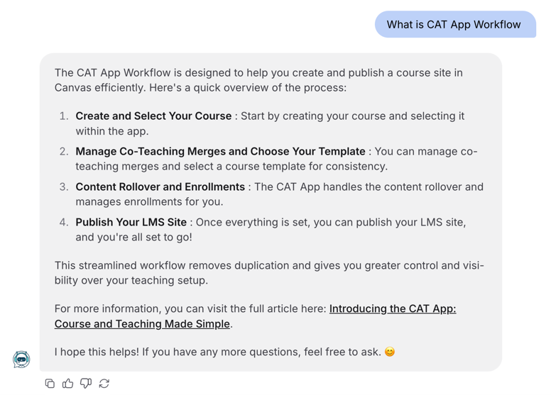

# AI Chatbot Upgrade: Technical Improvement Summary

## 1. Background & Purpose

To enhance the chatbot’s accuracy and reliability, we implemented several key upgrades focused on prompt control, input matching, and answer traceability. These improvements ensure the chatbot responds with higher consistency and stronger alignment with official training materials.

---

## 2. Technical Enhancements

###  Lower Generation Temperature
The model’s temperature setting was reduced to limit randomness and prevent off-topic or speculative responses.

###  Fuzzy Input Matching
User inputs are now more flexibly matched to relevant training content. Or keywords reach similarity up to 70% will guide to the existing training materials. For example:
- “How do I access Canvas?” will match content under “Login to Canvas”.

###  Step-by-Step Alignment with Source Materials
Prompts now include explicit instructions to follow the original training steps. This ensures the output mirrors the order and structure of official documentation.

###  Added Prompt Constraints
Responses are constrained to exclude any unverified or speculative information. This keeps outputs grounded strictly in the uploaded training data.

###  Source Referencing
Where applicable, chatbot answers now include document names or section references to enhance transparency and auditability.  
Example: *(Source: Canvas User Guide, Section 2.4)*

---

## 3. Example

