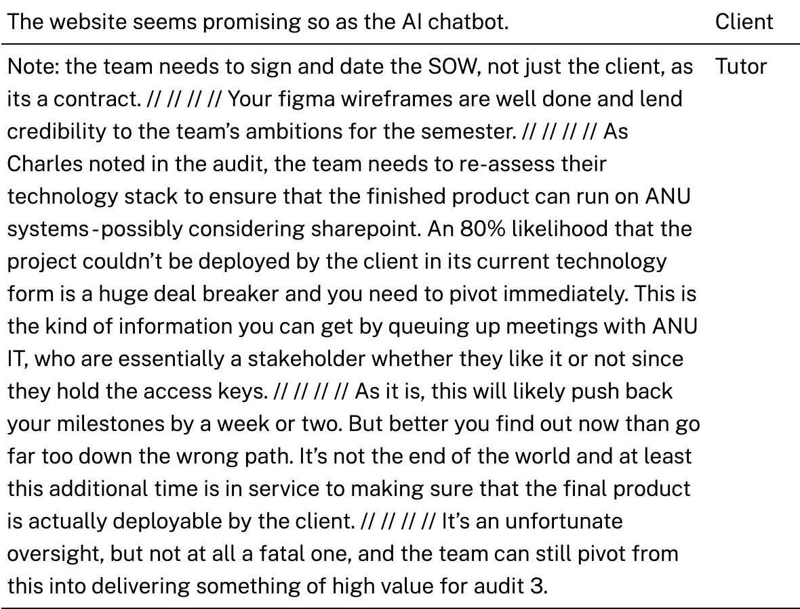
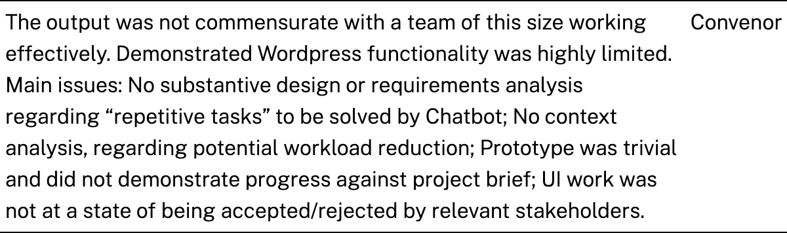
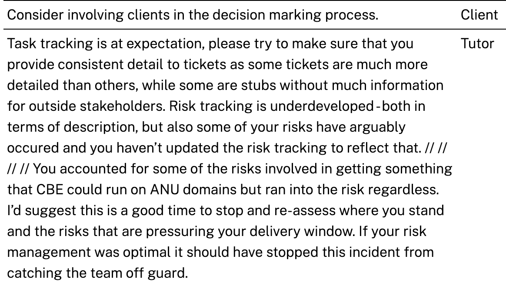
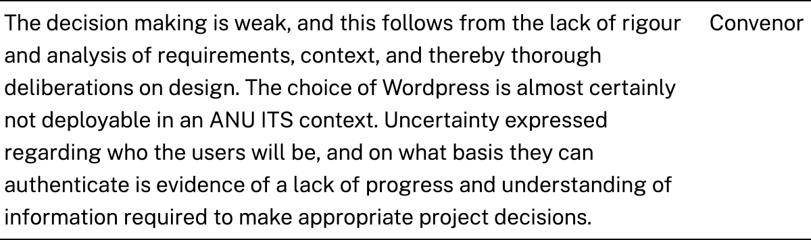
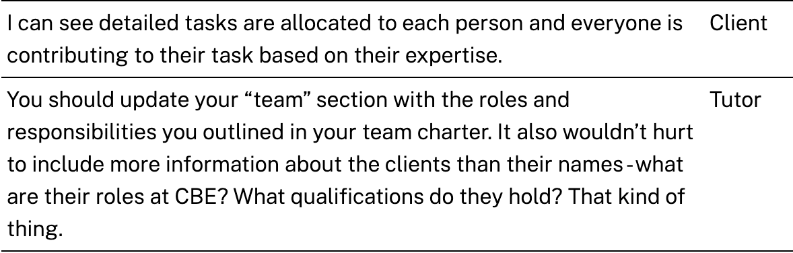
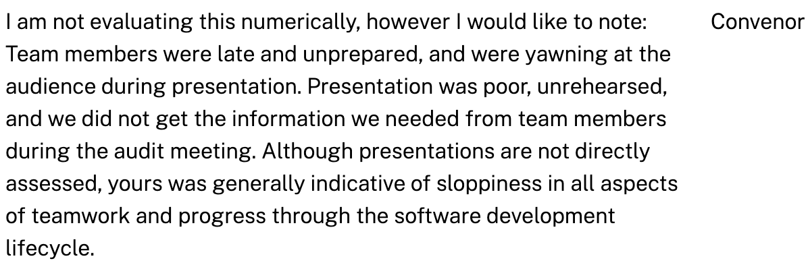
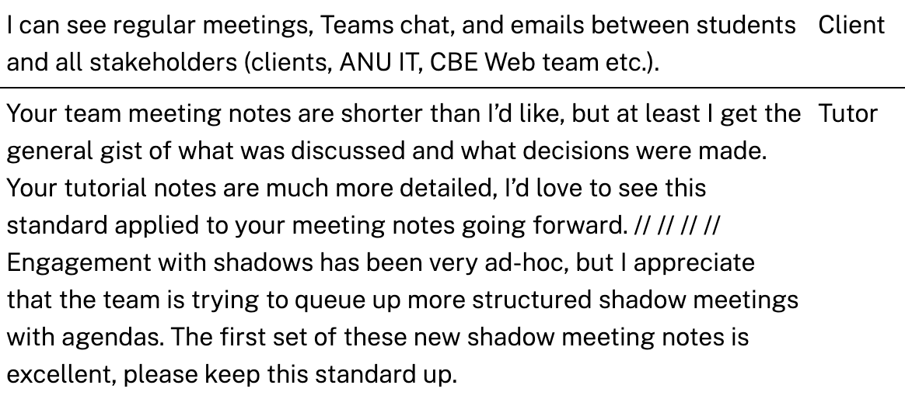
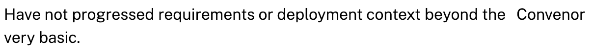
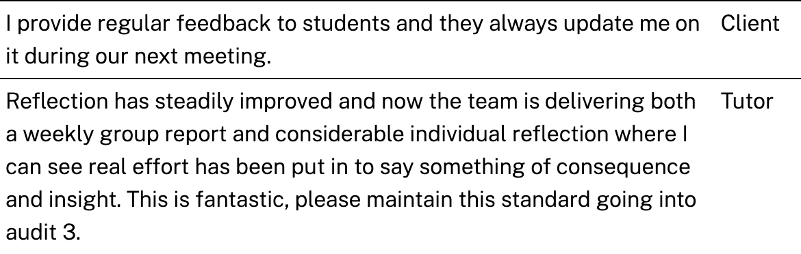

# Week 7 -Tutor Meeting 
**Info:**
- Time: 20 Sep, 10:00-11:00am
- Location: Ian Ross R221
- Scribe: Andy 
- Minutes taker: Jinghan Gao
- Describe: Review Audit 2, Report on the Work of the Past Few Weeks

**Attendees:**
- Andy
- Team
- Shadow Team

## Agenda Items
| Number     | Item                                                               |
|:----------:|:------------------------------------------------------------------:|
| Agenda 1   | Homework submission reminder                                       |
| Agenda 2   | Presentation by the shadow team on the work they have undertaken   |
| Agenda 3   | Presentation by the our team on the work they have undertaken      |
| Agenda 4   | Andy Comments on Audit 2 Feedback for shadow team                  |
| Agenda 5   | Andy Comments on Audit 2 Feedback for our team                     |

## Meeting minutes
#### Agenda-1: Homework submission reminder   
The meeting began with the Andy, he introduced this week’s main agenda, which included reviewing the audit feedback and discussing outstanding deadlines. He emphasized the homework submission requirements, noting that each team needs to submit a PDF file containing a poster along with a three-minute video link or QR code. The poster should be well-prepared, and it is crucial that the video link is correctly embedded in the PDF file to avoid past issues with incorrect links.

Andy also highlighted the submission requirements and timeline for the WPP, with the submission deadline set for October 20. He reminded teams that next week is a break week with no formal meetings, but the following week will focus heavily on the WPP tasks. Andy specifically advised that if team members are interested in a particular task but are struggling to make a choice, they should reach out to him early for guidance and suggestions.

Andy then moved on to the process for the rest of the meeting, arranging for each team to share their screens and present their feedback. He instructed each team to save five pieces of feedback for discussion. This process was identified as a valuable touchpoint, helping teams to understand each other's progress and challenges.

#### Agenda-2: Presentation by the shadow team on the work they have undertaken
Andy asked the shadow team to present their updates, emphasizing that this presentation is a regular part of their weekly agenda. Andy encouraged the team to share their progress and not to be surprised by this request as it has been a recurring expectation.

Shadow Team reported on their progress, mentioning that they have been implementing various policies and working on specific goals for the week. The team noted that they were still exploring options and were facing difficulties in realizing certain features, particularly in visualizing models and creating a user-friendly interface.

Andy provided feedback on the presentation, focusing on the importance of delivering a clear elevator pitch. He explained that a good elevator pitch should include a defined problem, a proposed solution, and the unique selling points of the solution. Andy acknowledged the team’s effort but pointed out that while they discussed what they were doing, they missed explaining why their approach existed or the rationale behind it.

Shadow team further elaborated on the current state of their project, discussing their ongoing work on the website and noting that some functions were still in development. They shared their experience in dealing with the complexities of implementing certain functionalities and described their attempts to make the website more engaging. Andy recognized the effort but reminded the team to focus on clarifying the purpose and impact of their work when presenting.

#### Agenda-3: Presentation by the our team on the work they have undertaken 
Andy started by prompting our team to present updates on our project, encouraging us to provide insights on our progress with SharePoint. He acknowledged the team's work so far, especially the challenges faced in positioning elements like photos and buttons within SharePoint.

Our team explained that the team explored various methods to implement the recommended functionalities and is currently comparing the differences between SharePoint Wordpress and React. The discussion covered the decision-making process behind choosing these technologies and the feedback received so far. The team acknowledged that while SharePoint is not the perfect solution, it is still one that meets some of the necessary requirements.

Andy then encouraged the team to refine their presentation approach, emphasizing the need for an effective elevator pitch. He pointed out that an elevator pitch should clearly outline the problem, the solution, and the unique selling points of the project. The team was advised to avoid detailed technical explanations during pitches and instead focus on engaging the audience by clearly explaining what the project is about, who it is for, and why it matters.

Bei Jin highlighted that the team has been working on integrating a chatbot feature and that while some development limitations prevent full local implementation, alternatives such as using SharePoint's existing infrastructure were being considered. 

Andy provided further feedback, urging the team to be prepared for future presentations by either improvising an elevator pitch or preparing a script that could be memorized. He stressed the importance of being able to confidently answer questions about the project, especially in scenarios where stakeholders may be emotional or upset about project outcomes. Andy reiterated the value of a well-structured pitch, which would help position the project clearly and compellingly to clients and other stakehol

#### Agenda-4: Andy Comments on Audit 2 Feedback for shadow team 
Andy began by providing feedback on the shadow team's performance, emphasizing the importance of maintaining professionalism under pressure. He highlighted that the ability to stay calm and composed when presenting or responding to feedback is a key trait that distinguishes professional project managers. Andy also reminded the team that their performance is continuously evaluated, and their ability to handle feedback effectively reflects their maturity in managing projects.

Andy moved on to review the team's audit feedback, noting that some inconsistencies were observed between the team’s outputs and the expected standards. He pointed out that, while feedback is provided to guide improvements, there were instances where disagreements between tutors and examiners on scoring were noted. He encouraged the team to refine their approach and align their outputs more closely with project expectations.

Andy acknowledged that the shadow team started at a disadvantage compared to other teams but recognized the progress they had made in catching up. He emphasized the importance of showcasing their work comprehensively, suggesting that the team needs to present their code, robot demonstrations, videos, and other outputs in a way that is engaging and accessible to the audience. Andy stressed that their presentations should not just focus on the technical aspects but also highlight the product's features and interface in an appealing manner.

He also emphasized the importance of documentation, pointing out that although it may not be the most exciting task, it is essential for providing evidence of the work completed. Andy mentioned that many stakeholders, including project managers who may not be deeply technical, rely heavily on documentation to understand the project’s progress. Therefore, maintaining clear and comprehensive documentation is crucial.

Andy also critiqued the shadow team’s approach to product design, encouraging them to think more about the product's look and feel, not just its functionality. He suggested incorporating interactive elements, such as animations or feedback mechanisms, that engage users on multiple sensory levels, making the product more appealing and effective.

Towards the end, Andy highlighted the importance of user feedback, advising the team to integrate real user insights into their project whenever possible. He suggested arranging user testing in future client meetings to gather valuable feedback that can help fine-tune the product.

Andy concluded by encouraging the team to continue refining their processes, emphasizing that there is always room for improvement in areas like decision-making, documentation, and cross-referencing information within their project logs. He praised the team for their resilience and adaptability, advising them not to dwell too much on past setbacks but to focus on delivering quality outputs moving forward.

#### Agenda-5: Andy Comments on Audit 2 Feedback for our team      

Andy began by discussing the audit feedback for our team, focusing on the quality of our outputs and the importance of showcasing our work effectively. He noted that although our clients generally seemed satisfied with the project, it is crucial to demonstrate the tangible work done and ensure that the outputs clearly reflect the effort put in. Andy emphasized the need to go beyond simply showing the end product by providing comprehensive evidence of the work done, including videos, documentation, and decision logs.

Andy highlighted the transition to SharePoint as a significant research and upskilling effort for the team, particularly as it occurred mid-semester. He stressed that this effort should be clearly communicated during presentations, not only as a technical shift but as a substantial learning curve that the team overcame. He advised that all learning activities, including workshops, learning new technologies, and adapting to changes, should be documented and credited appropriately in future audits.

Andy mentioned that while the feedback suggests that outputs are behind schedule, this might be less about the actual work and more about the visibility and presentation of that work. He recommended creating detailed walk-through videos of the SharePoint components, showing every element clearly to make the project’s value apparent. He pointed out that often, clients may not fully understand the technical depth of the work without these demonstrations, which could lead to misunderstandings about the project’s progress and quality.

Andy also addressed the importance of good documentation, pointing out that many project stakeholders, including non-technical clients, rely heavily on documentation rather than delving into the code itself. He suggested that every decision, research activity, and modification should be carefully documented to provide a clear trail of the project’s evolution. Andy emphasized the importance of making all outputs visible, including the decision-making processes, research, and adaptation to new tools like SharePoint.

Andy further discussed the need for a structured approach to feedback and project adjustments. He highlighted that past mistakes, such as misinterpreting requirements or changing directions mid-project, are not uncommon but should be learning experiences. He suggested that more oversight is needed in decision-making, with clear ownership assigned to specific tasks to ensure that all planned actions are completed as expected. This approach helps to verify that decisions are not just made but also executed as intended.

Andy also pointed out the importance of user feedback, encouraging the team to involve actual users in testing where possible. He suggested that at future client meetings, it would be beneficial to propose user testing sessions to gather insights that could further refine the project.

## Action Items
| Task                        | Assigned To  |  Due Date  |
|:---------------------------:|:------------:|:----------:|
| Wordpress                   |  XJS LYO     | 23 Sep     |
| Sharepoint                  |  ZYJ CYR     | 23 Sep     |
| React                       |  LBK BJ      | 23 Sep     |
| Meeting minutes             |  GJH         | 23 Sep     |

    
## Outcome
- Demos of the three technologies(Wordpress, Sharepoint, React)
- Various technical scoring forms

## Other Notes
N/A